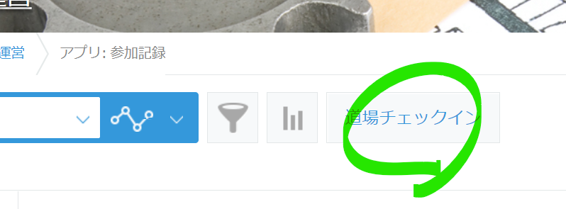
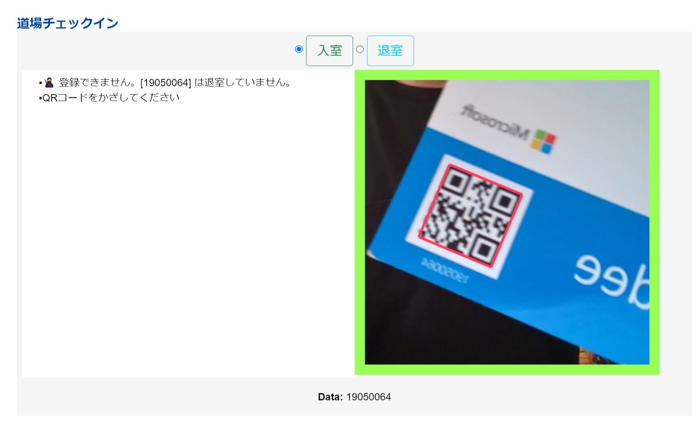

# qr-checkin-plugin

iPadをQRチェックイン/チェックアウト端末化するkintoneプラグインです。

kitnoneに適用することで、QRコード読み取り機能を備えたチェックポイント端末化します。カメラ付きのノートPCやiPadなどでご利用ください。

チェックインの前にチェックアウトが必要な双方向チェックスタイルと、何回でも連続でチェックイン可能な一方向チェックスタイルを選ぶことができます。

主に[コーダー道場神山](https://coderdojo.kamiyama.club)の入退室管理に使う目的で開発しました。

## インストール

### プラグインをインストールする

お使いのkintone環境に、プラグインとしてインストールしてください。

### ３つのフィールドを備えたアプリを用意する

プラグインを適用するアプリには、１つ以上のルックアップと、１つ以上の日時フィールドが必要です。日時フィールドはチェックインとチェックアウトをそれぞれ個別に指定できますので、ここでは下記３つのフィールドをkintoneアプリに設置してください。

- `ルックアップ`（会員ID参照用）
- `日時フィールド_1`（チェックイン用）
- `日時フィールド_2`（チェックアウト用）

読み取ったQRコードでルックアップして情報を取得し、同時に現在時刻をチェックイン/チェックアウトフィールドに記録します。

ルックアップやその他の情報用として自由にフィールドを追加できます。こちらの[アプリテンプレート](dist/kintone_app_template_v1.zip)もご利用ください。

## プラグインの実行方法

プラグインを適用すると、一覧画面の上部にチェックインボタンが表示されます。ボタンを押してフルスクリーンのチェックイン画面を呼び出します。

チェックイン画面に入ると、自動的にカメラが有効となります。カメラ画像にQRコードをかざすと読み取りが行われ、対応するIDがルックアップ先のアプリにあればルックアップで取得した情報とともに記録します。

## プラグインの設定項目

アプリにプラグインを適用後、プラグインの設定画面から下記の項目を設定してください。

- `タイトル` - QRリーダー画面上部に表示するタイトル文字列です。
- `チェックインフィールド` - チェックインの日時を格納する日時フィールドをプルダウンで選択します
- `チェックアウトフィールド` - チェックアウトの日時を格納する日時フィールドをプルダウンで選択します
- `メンバーIDフィールド` - QRコードを読み込むルックアップフィールドをプルダウンで選択します
- `チェックスタイル` - `双方向`または`一方向`をラジオボタンで選択します
- `閉じる挙動のカスタマイズ` - チェックボックスで有効無効を切り替えます。
    - `ボタンで閉じる` - 有効にするとQRリーダーにCloseボタンを表示します
    - `画面のダブルクリックで閉じる` - QRリーダー画面上をダブルクリックすると閉じます
    - `3本指のマルチタップで閉じる(iOS)` - iPadなどで、3本指のマルチタッチによってQRリーダーを閉じます。
- `ガードレール: 多重チェックイン回避` - 指定秒数（ミリ秒）の間、同一IDの連続チェックインを回避します。
    - このとき指定時間内であっても別IDのチェックインを挟むとチェックイン可能です。

## このプラグインの中で利用しているOSS

下記のライブラリを使用しています。

- `jQuery` - https://jquery.com/
- `MicroModal`    - https://github.com/Ghosh/micromodal
- `noSleep`   - https://github.com/richtr/NoSleep.js/
- `jsQR`  - https://github.com/cozmo/jsQR
- `51-modern-default.css` -  https://github.com/kintone-samples/plugin-samples/blob/master/stylesheet/51-modern-default.css

## プラグインのアイコンについて

[icone](https://icone.unique-work.com/)さんで公開されているアイコンを使わせていただきました。今回は使っていませんが「入力された文字のアイコンを自動生成」機能がとても便利でいつもお世話になっています。

- https://icone.unique-work.com/
- https://twitter.com/ICONE_by_UW

## License

QRチェックインプラグインはMITライセンスの元で公開しています。
This plugin is licensed under MIT license.

Copyright (c) 2022 Daisuke Motohashi
https://opensource.org/licenses/MIT
